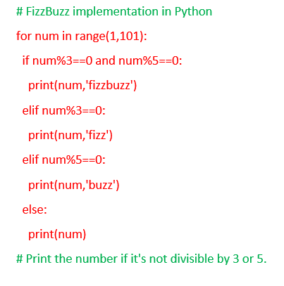
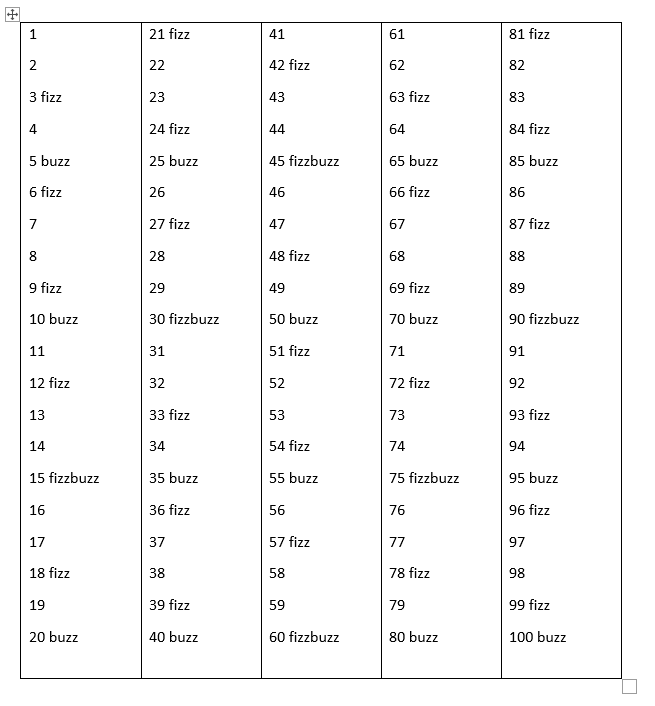

## Python-FizzBuzz-Project

**FizzBuzz:**

Go through the integers from 1 to 100.

If a number is divisible by 3, print "fizz."

If a number is divisible by 5, print "buzz."

If a number is both divisible by 3 and by 5, print "fizzbuzz."

Otherwise, print just the number.

**I have used Python syntax to follow the criteria to complete the FizzBuzz project** 

* **My Syntax are shown below**

* **Output are shown below**

Full Project work book [here](https://drive.google.com/file/d/1EfY1SRuvoq-_E8yLLLe7TAMSPyAzq7D6/view?usp=drive_link)

Click [here](https://github.com/Alamin-analyser/Python-GDP-Project) to see another Python Project.
